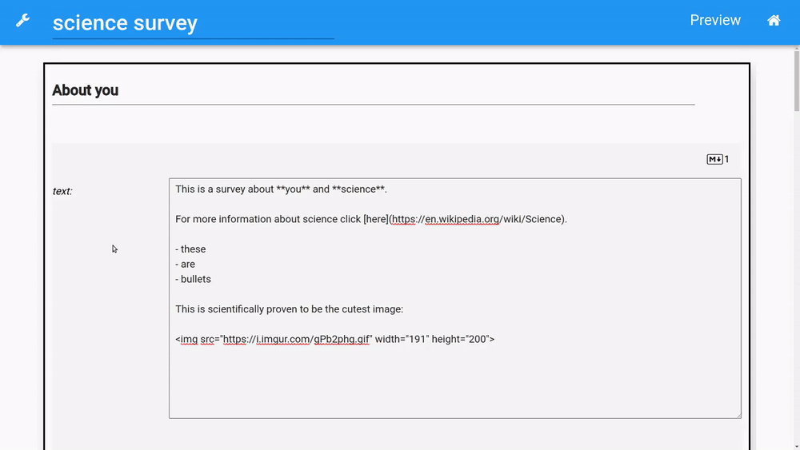

# OpenQuestion <a href="https://Alcampopiano.github.io/OpenQuestion/"></img></a>
[](https://pypi.org/project/OpenQuestion/)
[](https://pypistats.org/packages/OpenQuestion)
[](https://github.com/Alcampopiano/OpenQuestion/blob/master/LICENSE)

OpenQuestion is a survey building platform written in Python. 
Surveys can be developed using a GUI or by writing Python code. 
OpenQuestion is built with the open source Anvil App Server, a runtime engine 
for writing full-stack web applications in Python.

## Documentation
:book: Please visit the [OpenQuestion documentation site](https://Alcampopiano.github.io/OpenQuestion/).

## Develop surveys with a GUI


## Surveys are stored as a Python dictionary/JSON

```python
my_survey={
  "title": "simple survey",
  "settings": {
  "survey_color": "#2196F3",
  "thank_you_msg": "#Thank you!"
  },
  "num_widgets": 2,
  "widgets": [
    {
      "id": 0,
      "type": "section",
      "logic": None,
      "title": "section",
      "widgets": [
        {
          "id": 1,
          "type": "text_box",
          "logic": None,
          "title": "what's your name?",
          "number": False,
          "mandatory": True,
          "placeholder": "placeholder here"
        }
      ]
    }
  ]
}
``` 

## Citing OpenQuestion
... coming soon
