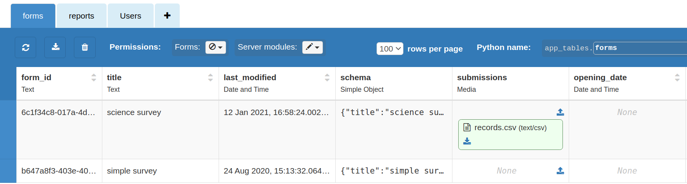

# Advanced usage
The following topics are for somewhat advanced use cases and are not needed for
basic GUI-based survey development. The topics generally cover features that
make it possible to automate survey development and modification, backup survey structures, 
associate meta-data with surveys, and more.

## OpenQuestion's database



## Accessing the Python Shell (for app administrators)
From the command line (where the OpenQuestion is below the current directory) run the app server 
with the `--shell` option. This will drop you into a Python interpreter that is 
connected to OpenQuestion's database. 

```
anvil-app-server --app OpenQuestion --shell
```

Once in the Python shell, OpenQuestion's priviledged server code and databases are accessible. 
To interact with the databases, see Anvil's [DataTables API](). For example,

bla bla

## Giving developers access to the Python shell
Developers can also interact with OpenQuestion's server code and databases from Python.
First, the app's administrator must generate 
a token (a so-called [Uplink](https://anvil.works/docs/uplink) key) and associate it with 
OpenQuestion as follows:

```
 anvil-app-server --app OpenQuestion --uplink-key <you-secret-key>
```

!!! danger "Be careful when creating an Uplink key"
    Uplink keys should be long, secure, and random. Do not share the key
    with anyone except for those who you want to have access to
    OpenQuestions privileged server code and databases

Developers can now connect to OpenQuestion with Python code by following these steps:

```
pip install anvil-uplink
```

```python
# connecting to OpenQuestion
anvil.server.connect("[uplink-key goes here]", url="ws://your-runtime-server:3030/_/uplink")`
```

Once sucessfully connected, developers will have priviledged access to OpenQuestion's server code
and databases from their Python environment.

## URL parameters