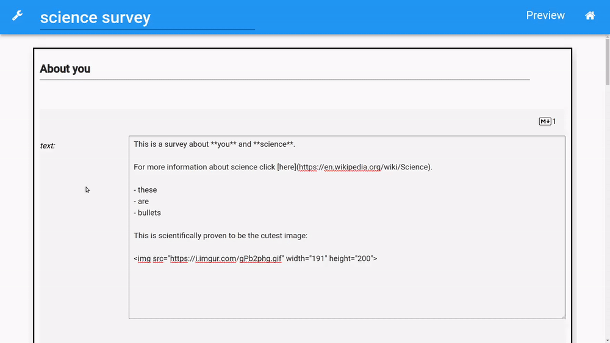

# OpenQuestion: A Python based open source survey platform
OpenQuestion is an open source and developer focused platform for building surveys.
Surveys can be designed using a GUI and are represented
by an underlying and accessible Python dictionary.

**Example of survey development in OpenQuestion**

## User Guide
- [Survey Development](survey_dev.md)
- [Widget List](widgets.md)
- [Survey Settings](settings.md)
- [Installation](installation.md)
- [Advanced Usage](advanced.md)
- [FAQ](faq.md)

## Bug reports and Questions
OpenQuestion is BSD-licenced and the source code is available
on [GitHub](https://github.com/Alcampopiano/OpenQuestion).
For issues and questions, 
please use [GitHub Issues](https://github.com/Alcampopiano/OpenQuestion/issues).

## Citing OpenQuestion
coming soon ...

## Contributing to OpenQuestion

The best way to contribute to OpenQuestion is to ... 
For more details, please see 
[CONTRIBUTING.md](https://github.com/Alcampopiano/OpenQuestion/blob/master/CONTRIBUTING.md)
in the GitHub repository.

