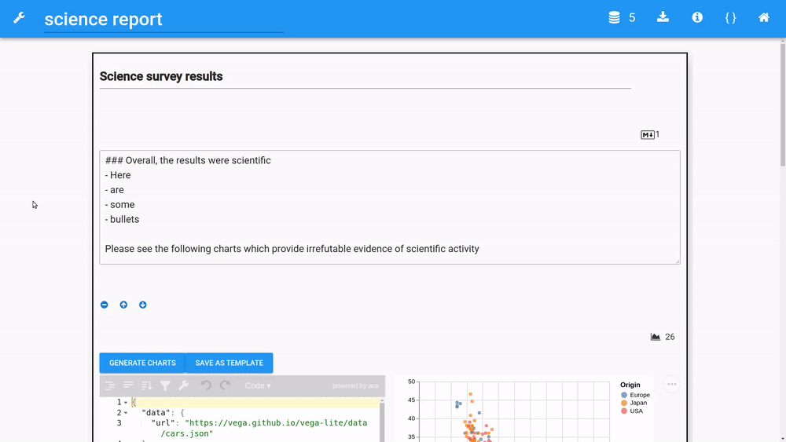
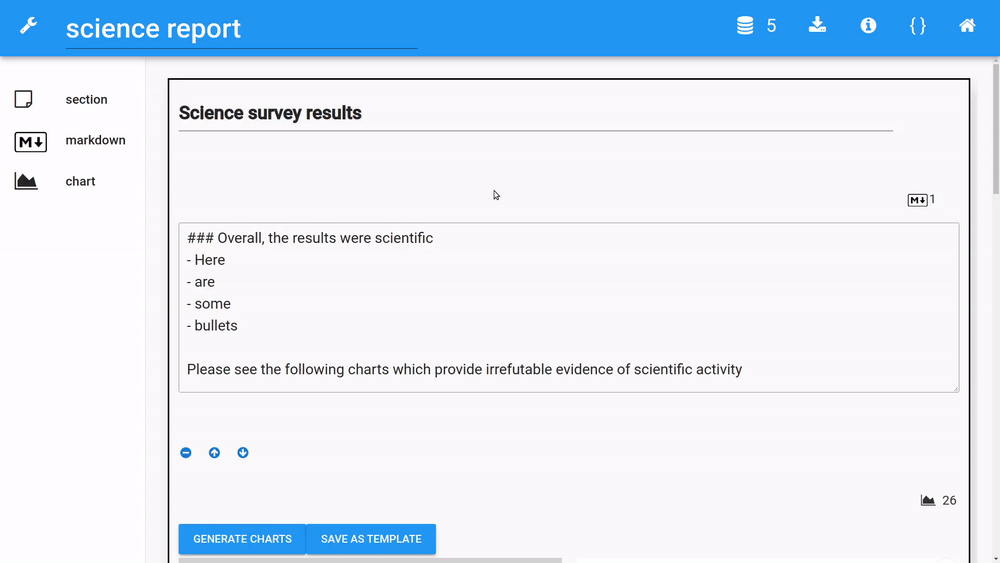

# Reporting
OpenQuestion's reporting module allows researchers to describe their data by building
custom interactive visualizations, and writing rich text. In addition, 
reports can be exported as interactive HTML files for sharing.

**Report development**


## Building interactive charts with Vega-Lite
OpenQuestion leverages the high-level and powerful [vega-lite](https://vega.github.io/vega-lite/)
visualization library. As shown above, the left toolbar contains a chart widget. The chart widget
is composed of two panels: a [JSON editor](https://github.com/josdejong/jsoneditor) and a chart display.

The JSON editor is for writing the vega-lite specifications (i.e., JSON that describes a chart). 
When the specification changes, the chart panel on the right will update accordingly.
Please see the [vega-lite](https://vega.github.io/vega-lite/) documentation for more 
information and examples.

Vega-lite specs can reference data sets by a URL or by the data set's name. An example of a reference by url
is given when a chart widget is added to the page. It looks something like this (just notice the `url` field):
 
```json
{
  "data": {
    "url": "https://vega.github.io/vega-lite/data/cars.json"
  },
  "mark": {
    "size": 100,
    "type": "circle"
  },
  "width": 310,
  "height": 300,
  "$schema": "https://vega.github.io/schema/vega-lite/v4.json",
  "encoding": {
    "x": {
      "type": "quantitative",
      "field": "Horsepower"
    },
    "y": {
      "type": "quantitative",
      "field": "Miles_per_Gallon"
    }
  }
}
```

And here is a spec that references a loaded data set by its filename: 

```json
{
  "data": {
    "name": "my_survey_data.csv"
  },
  "mark": {
    "size": 35,
    "type": "bar"
  },
  "width": 310,
  "height": 300,
  "$schema": "https://vega.github.io/schema/vega-lite/v4.json",
  "encoding": {
    "x": {
      "type": "nominal",
      "field": "Year"
    },
    "y": {
      "type": "quantitative",
      "field": "Score",
      "aggregate": "sum"
    },
    "color": {
      "type": "nominal",
      "field": "School"
    }
  }
}
```

## Using the markdown widget in reports
The markdown widget in the reporting module works the same as markdown widgets in the survey module!
Use this widget to describe your data just as you would in a Jupyter Notebook.

## Reporting tools
The upper right toolbar contains buttons that allow loading more data sets as well as to
get a quick reminder of the characteristics of the currently loaded data sets. In addition,
the report can be compiled to an interactive HTML report. These features are described in the next section.

**Reporting toolbar (upper right)**


### Loading data sets
Firstly, when inside the reporting module the data set that is associated with the given survey
is always loaded and therefore available to use for charting (refered internally as `records.csv`. 
To load additional data sets, click on the database icon in the upper right toolbar. 
Note that OpenQuestion expects flat CSV files. The number next to the icon indicates 
how many data sets you have loaded (including the data set associated with the current survey)

### Looking at data set heads (i.e., first 5 rows and column headers)
While charting, column names must be referred to. In order to see the first 5 rows
and the collumn headers of all loaded data sets, click in the "info" icon.

### Downloading interactive HTML reports
Clicking the download icon in the upper right toolbar compiles the report to 
HTML and downloads the file to your computer. The resulting HTML file maintains 
all of the interactivity in the chart widgets and removes the JSON spec panels. For example:

**Download HTML report**


!!! note "Refreshing the core dataset"
    Whenever new data sets are loaded, a report is saves, or the report module is opened,
    the newest version of the data set associated with the survey is loaded. This means that if new 
    submissions have been accumulating since you last looked at report, 
    the charts may look different as the data set has grown. If you prefer a static data set from the survey, 
    just download it from the survey dashboard, rename it, and load it into the reporting module.


