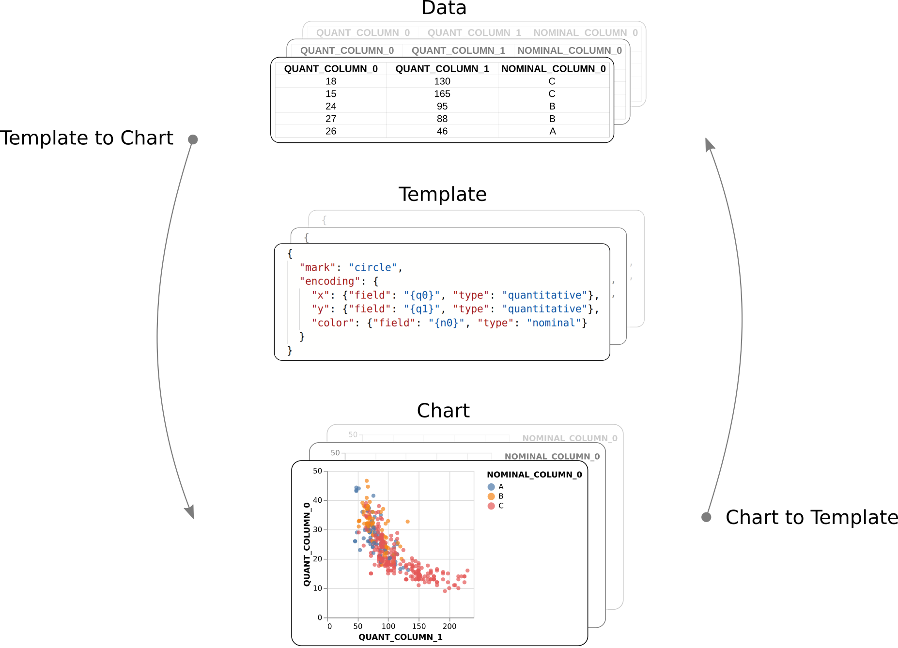

# Reporting
OpenQuestion's reporting module allows researchers to create a document containing interactive charts and rich text
in order to describe one or more datasets (reminiscent of a Jupyter-like experience).
Charts can be specified manually or generated automatically using a template matching process (described below). 
Reports can be exported as interactive HTML files for sharing.

**Report development**


## Building interactive charts with Vega-Lite
OpenQuestion leverages the high-level and powerful [vega-lite](https://vega.github.io/vega-lite/)
visualization library. As shown above, the left toolbar contains a chart widget. The chart widget
is composed of two panels: a [JSON editor](https://github.com/josdejong/jsoneditor) and a chart display.

The JSON editor is for writing the vega-lite specifications (i.e., JSON that describes a chart). 
When the specification changes, the chart panel on the right will update accordingly.
Please see the [vega-lite](https://vega.github.io/vega-lite/) documentation for more 
information and examples.

Vega-lite specs can reference datasets by a URL or by the dataset's name. An example of a reference by url
is given when a chart widget is added to the page. It looks something like this (just notice the `url` field):
 
```json
{
  "data": {
    "url": "https://vega.github.io/vega-lite/data/cars.json"
  },
  "mark": {
    "size": 100,
    "type": "circle"
  },
  "width": 310,
  "height": 300,
  "$schema": "https://vega.github.io/schema/vega-lite/v4.json",
  "encoding": {
    "x": {
      "type": "quantitative",
      "field": "Horsepower"
    },
    "y": {
      "type": "quantitative",
      "field": "Miles_per_Gallon"
    }
  }
}
```

And here is a spec that references a loaded dataset by its filename: 

```json
{
  "data": {
    "name": "my_survey_data.csv"
  },
  "mark": {
    "size": 35,
    "type": "bar"
  },
  "width": 310,
  "height": 300,
  "$schema": "https://vega.github.io/schema/vega-lite/v4.json",
  "encoding": {
    "x": {
      "type": "nominal",
      "field": "Year"
    },
    "y": {
      "type": "quantitative",
      "field": "Score",
      "aggregate": "sum"
    },
    "color": {
      "type": "nominal",
      "field": "School"
    }
  }
}
```

## Automatic chart generation
Charts can be created automatically by clicking the "generate charts" button. The resulting dialogue
will require a dataset and one or more columns to be selected. Under the hood, OpenQuestion
will try to match those columns to one or more templates that are stored interenally. Templates are simply
vega-lite JSON specifications that have placeholders for a certain number of fields with given data types 
(e.g., two quantitaive fields and one nominal field). If one or more compatible templates are found,
the resulting charts and populated specs are displayed one at a time in the chart widget
(page through them with the arrow buttons). These charts can of course be modified as usual
by changing the vega-lite spec in the JSON editor.

!!! note "Supported data types"
    When using automatic chart creation, OpenQuestion looks to see if columns in
    your dataset are quantitative, nominal, or temporal. Those are the only data types
    that are supported and therefore templates are matched accordingly. Temporal
    columns are determined by seeing if they can be converted to valid datetimes using Pandas.
    
!!! tip "ordering of columns"
    When using automatic chart creation, OpenQuestion assigns columns to fields in the vega-lite spec
    based on the order in which they are selected. Therefore, it is possible that a chart is created
    where, for example, a quantitative value is on the X axis, but you want it on the Y axis. In this case,
    you may change the vega-lite spec accordingly, or select the columns in the opposite order. OpenQuestion
    is concerened about mapping columns in the data to fields in the vega-lite spec with the same data type. 
    It does not try to chart all possible permutations of the matching specs.
    
!!! warning "`check_box` widgets not supported"
    OpenQueston does not yet provide any functionality to automatically chart
    nested data (e.g., those collected from the `check_box` widget). You may transform the 
    data locally and upload it into OpenQuestion though.

## Saving charts to templates
Any chart can also be converted to a template that will then be used in the matching process 
described above (click the "save as template" button).
This means that, if there is a chart configuration that needs to be used again 
(perhaps it was a difficult chart to design), it can be saved as a template. The next time 
a set of compatible columns from any dataset are selected, a chart with the same 
charateristics can be generated automatically. This is shown in picture form in the figure below.
Saved tempates, along with their associated chart exemplars can be viewd by clicking the curly
braces ({}) icon in the reporting toolbar (upper right corner). 

**Report development**


## Using the markdown widget in reports
The markdown widget in the reporting module works the same as markdown widgets in the survey module!
Use this widget to describe your data just as you would in a Jupyter Notebook.

## Reporting tools
The upper right toolbar contains buttons that allow loading more data sets as well as to
get a quick reminder of the characteristics of the currently loaded data sets. In addition,
the report can be compiled to an interactive HTML report. These features are described in the next section.

**Reporting toolbar (upper right)**


### Loading data sets
Firstly, when inside the reporting module, the dataset that is associated with the given survey
is always loaded and therefore available to use for charting (refered internally as `records.csv`). 
To load additional datasets, click on the database icon in the upper right toolbar. 
Note that OpenQuestion expects flat CSV files. The number next to the icon indicates 
how many datasets you have loaded (including the dataset associated with the current survey).

### Looking at dataset heads (i.e., first 5 rows and column headers)
In order to see the first 5 rows and the column headers of all loaded datasets, click in the "info" icon.

### Downloading interactive HTML reports
Clicking the download icon in the upper right toolbar compiles the report to 
HTML and downloads the file to your computer. The resulting HTML file maintains 
all of the interactivity in the chart widgets and removes the JSON spec panels. For example:

### Viewing saved tempates
Saved tempates, along with their associated chart exemplars can be viewd by clicking the curly
braces ({}) icon in the reporting toolbar (upper right corner). The JSON specifications in this view
are read only.

**Download HTML report**


!!! note "Refreshing the core dataset"
    Whenever new datasets are loaded, a report is saved, or the report module is opened,
    the newest version of the dataset associated with the survey is loaded. This means that if new 
    submissions have been accumulating since you last looked at report, 
    the charts may look different as the dataset has grown. If you prefer a static dataset from the survey, 
    just download it from the survey dashboard, rename it, and load it into the reporting module.


