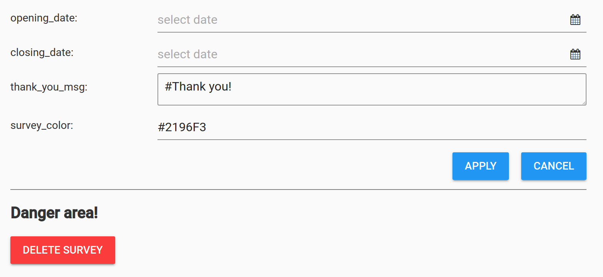

# Survey settings
Each Survey has its own settings and these can be 
accessed through the [survey dashboard](survey_dev.md#survey-dashboard) by clicking
the :material-cog: icon.

**Survey settings**

## Opening and closing dates
The opening and closing dates can be chosen by
selecting a date and time from the "date picker" elements.
If a date option is left blank, there is no restriction on the
corresponding field.

## Thank you message
The text area allows you to write markdown to express a "thank you message".
The message will appear after the survey has been submitted by the user.

## Survey color
You can change the main color of the end user's survey by entering a hex code (e.g., #2196F3)
This will not affect the color in the survey designer.

## Deleting a survey
The big red button allows a survey to be deleted. A confirmation
dialogue will pop up just to be safe.

!!! danger "Deleting a survey?"
    Be careful! Once a survey is deleted, its
    structure and associated data cannot be restored; however,
    if you have the JSON representation of your survey 
    saved on your local computer, you can restore the 
    survey structure using the [command line feature](advanced.md).