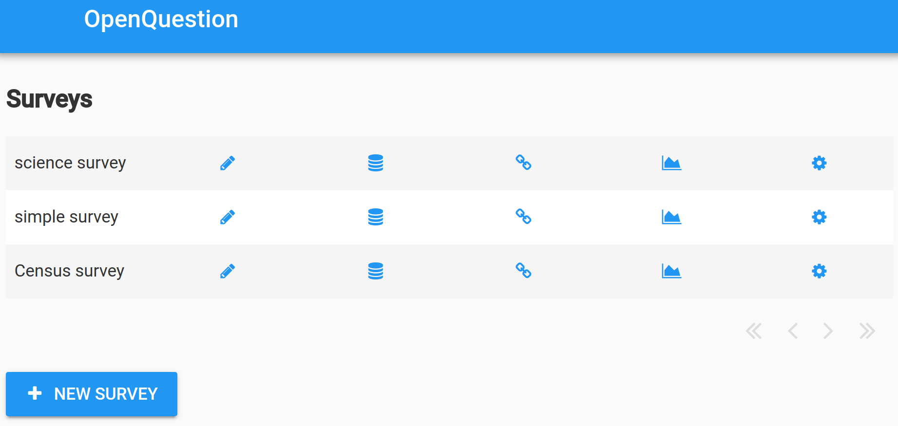
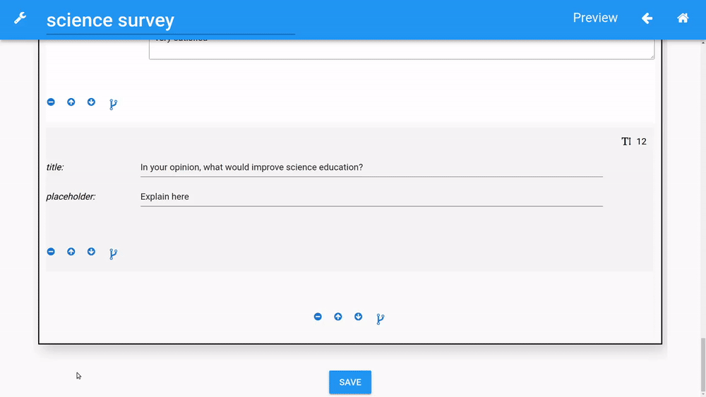

# Survey Development

## Survey dashboard
The survey dashboard allows you to edit, build, and configure [settings](settings.md) for your surveys. 
Survey data and share links can also be accessed from the dashboard. Clicking "New survey"
or the :material-pencil: icon will take you to the survey designer (explained below) for a new or
existing survey, respectively.

In addition, the survey dashboard gives you access to OpenQuestion's reporting module which allows
researchers to do the following:

- build interactive charts with vega-lite
    - charts can be built from survey data or datasets collected
outside of OpenQuestion
- Describe data using markdown widgets
- Export reports as interactive HTML files

Just click the chart icon and see the docs on [reporting](reporting.md) to learn more!

**The survey dashboard**

## Survey designer
The survey designer is where most of the survey development takes place. It consists of the 
[designer toolbar](survey_dev.md#designer-toolbar) (click on the :material-wrench: to 
toggle the side panel's visibility) and various other
UI elements, including those that allow you to structure 
your survey and control how it behaves. To preview the survey as the end user would see it,
click "Preview" at the top of the page (or access the share link from the dashboard).

**The survey designer**

## Designer toolbar
The designer toolbar contains widgets (e.g., text_box, drop_down, sections, etc). Clicking on the widgets 
adds them to the page below the currently selected element. The :material-wrench: icon will toggle the
toolbar's visibility.

**The designer toolbar**

## Widget settings
When a widget is added to the page during survey development, values need to be specified
to control how the widget appears to the end user. 

For example, the text_box widget requires the following information:

- _title_. The label displayed on this widget. For example, "What is your name?"
    
- _placeholder_. Text that prompts the user. For example, "Type your name here?"
   
- _mandatory flag_. If checked, this field must be filled out by the user before the survey can be submitted
    
- _number_. If checked, this field will be restricted to a number

The following example shows the designer representation of the text_box as well as what the end user sees.
    
**Designer**

**Survey**

        
All widgets have their own sets of options to be specified. Please click [here](widgets.md) 
to learn about the available widgets and how they are used.

!!! tip "Are widget settings represented as key/value pairs?"
    Yes! In fact, all survey settings are represented by an underlying 
    and accessible [JSON/Python dict](advanced.md) where keys and values
    corresspond exactly to what is shown in the designer

## Widget toolbar
Once a widget has been added to the page, the widget's toolbar can be used to move the widget up or down,
delete the widget, and control the widget's visibility with [branching](survey_dev.md#branching).

**The widget toolbar**

## Basic Widget controls
The :material-minus-circle: sign can be used to delete the widget and the up/down arrows can be used
to move the widget up or down.

## Branching
The :material-source-branch: icon opens up the branching UI. Branching controls the visibility
of the selected widgets (including sections) based on the values of other widgets.
Multiple conditions can be combined together to make complex branching rules if needed.
The below example shows a text_box widget's visibility being controlled by the 
value of a slider widget. In this case, whenever the slider goes below 40, 
the text_box is displayed. When branching exists on a widget, the :material-source-branch: icon
on the widget's toolbar is highlighted. 

**Setting branching rules on a text_box**

**The text_box is revealed when the condition is met**

