# Widget list
This section describes the available widgets and their options. When
a widget is added to the designer, it's associated icon can be 
seen in the top right corner of the widget area. This makes it easier
to see which kinds of widgets have been added to the page since 
OpenQuestion uses different interfaces for survey development and 
end-user data acquisition. Note that each added widget is also assigned an ID.
This can be ignored as it is mainly used internally (although, IDs
can disambiguate widgets that have been given the same title, 
especially in the branching interface). The following examples show the 
designer version of the widget as well as an example of what the end user sees.

## text_box
The text box is uses for short text or number responses. It can be
configured witht the following options:

- title 
    - For example, "What is your name?"
    
- placeholder 
    - text that prompts the user. For example, "Type your name here?"
   
- mandatory flag
    - if checked, this field must be filled out by the user before the survey can be submitted
    
- number
    - if checked, this field will be restricted to a number
    
**in the designer**
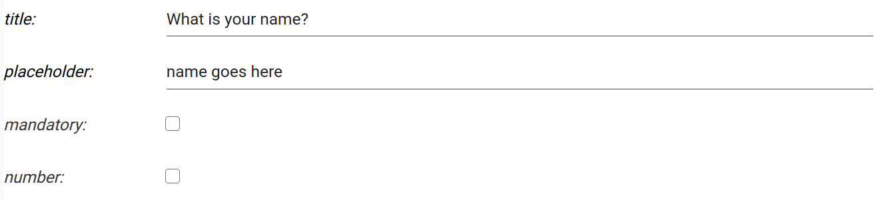

**shown to the user**
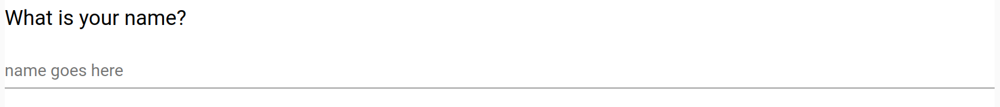

## text area
The text_area widget is used for long, possibly multi-line text responses. 
It can be configured with the following options:

- title 
    - For example, "Tell me about yourself?"
    
- placeholder 
    - text that prompts the user. For example, "text goes here?"
   
- mandatory flag
    - if checked, this field must be filled out by the user before the survey can be submitted

**in the designer**
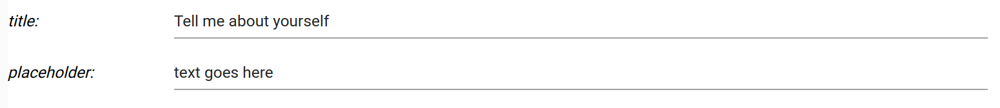

**shown to the user**
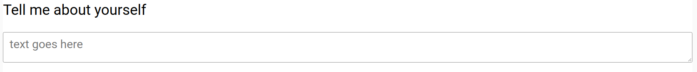

## drop_down
The drop_down widget is used for selecting from a set of categories.
It can be configured with the following options:

- title 
    - For example, "What is your highest completed educational level?"
    
- placeholder 
    - text that prompts the user. For example, "select from here?"
    
- options
    - newline separated list of options to be displayed in the drop down
   
- mandatory flag
    - if checked, this field must be filled out by the user before the survey can be submitted

**in the designer**
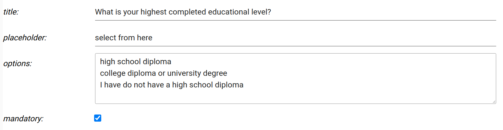

**shown to the user**
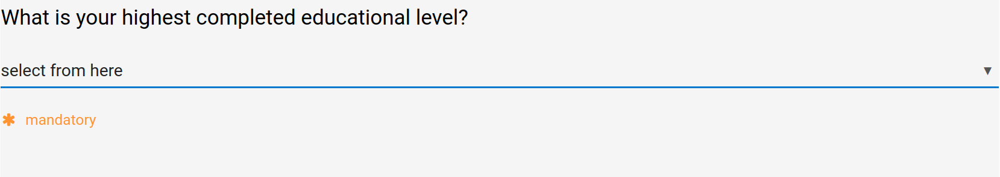

## check_box
The check_box component is used for selecting from a set of options where more than one option 
can be selected at the same time. It can be configured with the following options:

- title 
    - For example, "Which scientific topics are you interested in?"
    
- options
    - newline separated list of options
   
**in the designer**
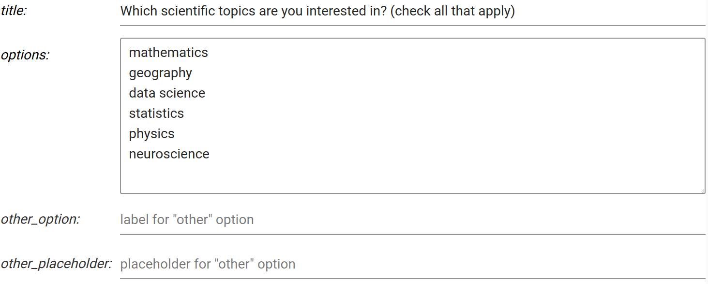

**shown to the user**
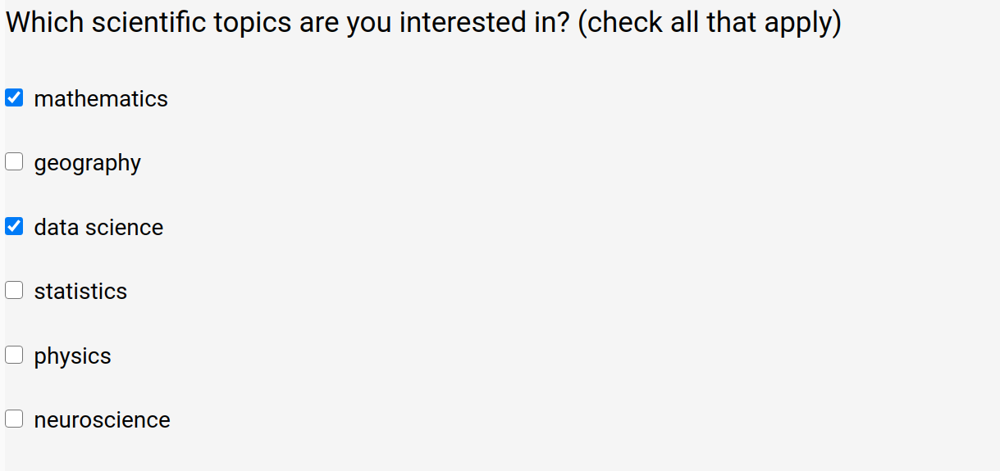

## radio_button
The radio_button component is used for selecting from a set of options where only one option 
can be selected at a same time. It can be configured with the following options:

- title 
    - For example, "Are you interested in science?"
    
- options
    - newline separated list of options

**in the designer**
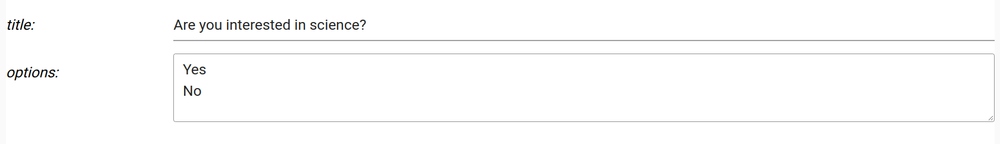

**shown to the user**
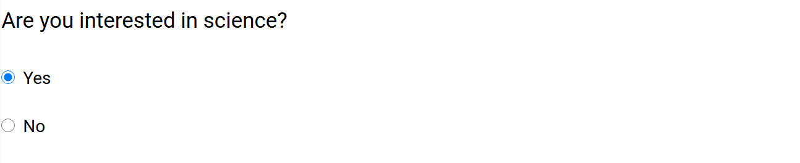

## date
The date widget is used for selecting dates from a "date picker" interface. 
It can be configured with the following options:

- title 
    - For example, "What is your date of birth?"
    
- placeholder 
    - text that prompts the user. For example, "date goes here?"
    
- format
    - date format string based on [these directives](https://strftime.org/). 
      For example, `%Y-%m-%d` yields `2021-01-11` in terms of the format.
   
- mandatory flag
    - if checked, this field must be filled out by the user before the survey can be submitted

**in the designer**
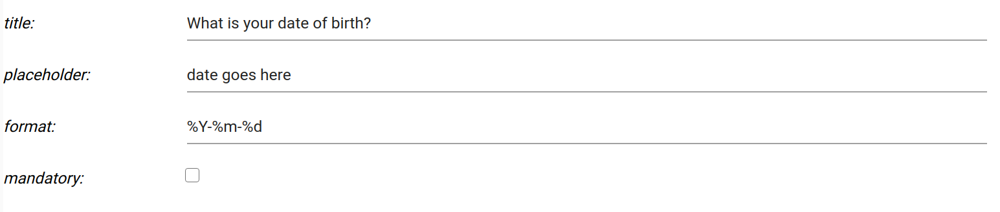

**shown to the user**
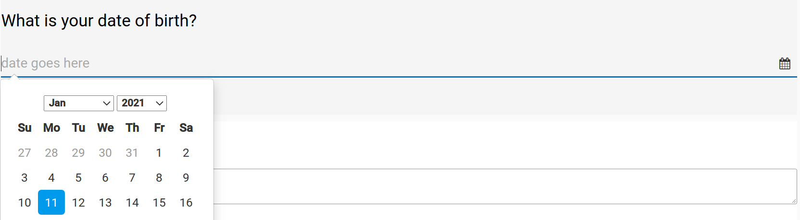

## slider
The slider widget is used for choosing a quantitative value from a range.
It can be configured with the following options:

- title 
    - For example, "How satisfied were you with your last science course?"
    
- min_val 
    - the minimum value shown on the slider
    
- max_val 
    - the maximum value shown on the slider
    
- step
    - the number of discrete steps that the slider "thumb" can occupy 
      between the min and max values (inclusive)
   
- value
    - the initial value of the slider "thumb"
    
- labels
    - newline seperated text labels that will be evenly spread across the
      width of the slider widget

**in the designer**
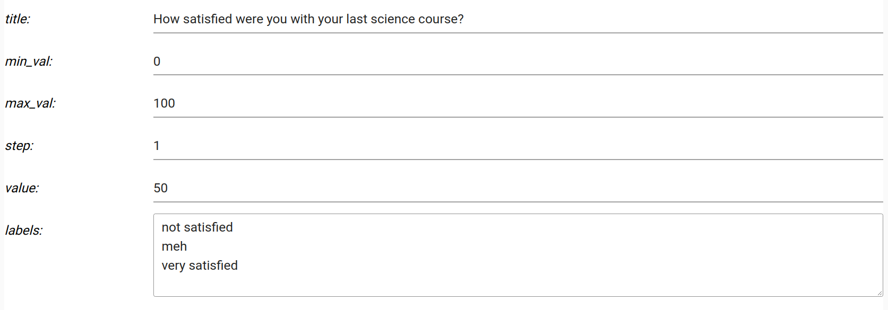

**shown to the user**
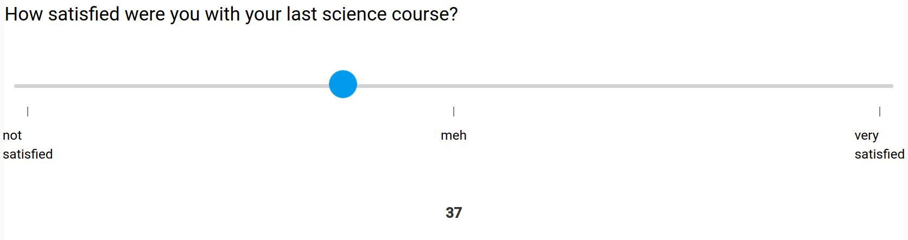

## markdown
The markdown component is used for blocks of rich text, including
links, images, gifs, bullet points, raw HTML, and more. 
It can be configured with the following option:

- text
    - the markdown text based on the [mistune](https://mistune.readthedocs.io/en/v0.8.4/) parser

**in the designer**
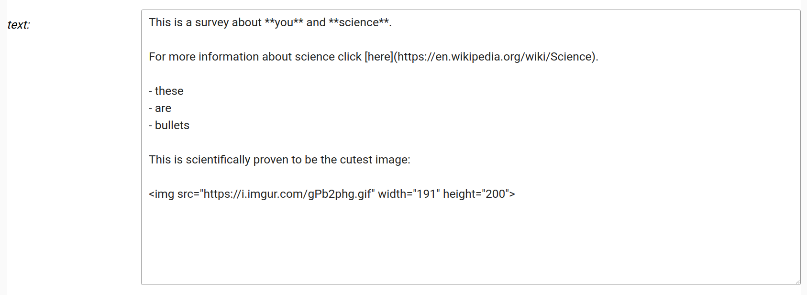

**shown to the user**
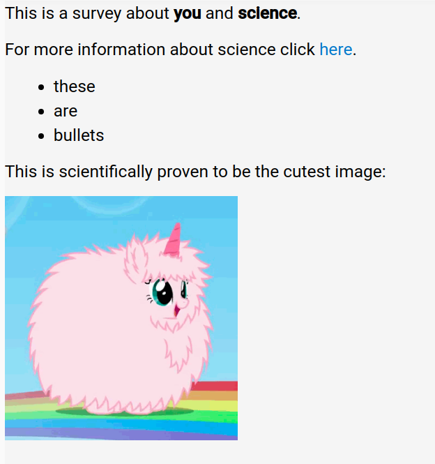

## section
The section widget is used to hold other widgets and give a visual separation of sets of widgets. 
Sections have their own title which can be set in the "title" field (e.g., "Contact information").
