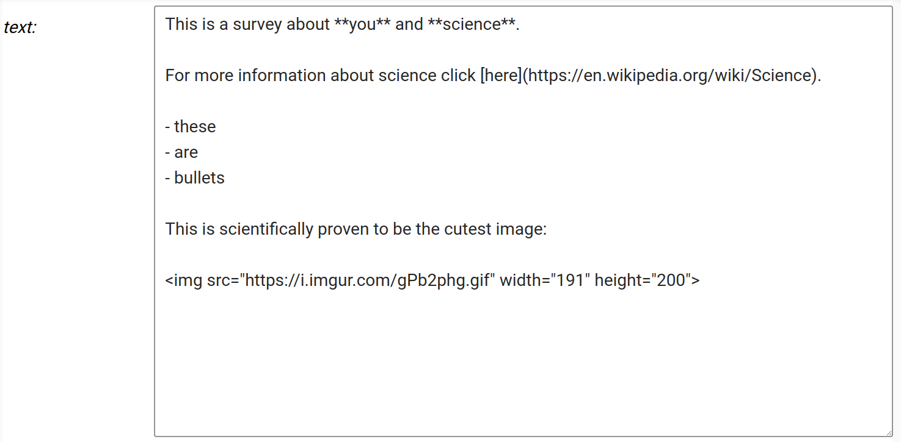

# Widget list
This section describes the available widgets and their options. 
The following examples show the designer version of the widget 
as well as an example of what the end user sees.

!!! note "Widget icons"
    When a widget is added to the designer, it's associated icon can be 
    seen in the top right corner of the widget area (not shown here). 
    This makes it easier to see which kinds of widgets have been added to 
    the page since OpenQuestion uses different interfaces for survey development 
    and end user data acquisition.  
    
## text_box
The text_box is used for short text or number responses. It can be
configured with the following options:

- _title_. The label displayed on this widget. For example, "What is your name?"
    
- _placeholder_. Text that prompts the user. For example, "Type your name here?"
   
- _mandatory flag_. If checked, this field must be filled out by the user before the survey can be submitted
    
- _number_. If checked, this field will be restricted to a number
    
**Designer**

**Survey**

## text_area
The text_area widget is used for long, possibly multi-line text responses. 
It can be configured with the following options:

- _title_. The label displayed on this widget. For example, "Tell me about yourself?"
    
- _placeholder_. Text that prompts the user. For example, "text goes here?"
   
- _mandatory flag_. If checked, this field must be filled out by the user before the survey can be submitted

**Designer**

**Survey**

## drop_down
The drop_down widget is used for selecting from a set of categories.
It can be configured with the following options:

- _title_. The label displayed on this widget. For example, "What is your highest completed educational level?"
    
- _placeholder_. Text that prompts the user. For example, "select from here?"
    
- _options_. Newline separated list of options to be displayed in the drop down
   
- _mandatory flag_. If checked, this field must be filled out by the user before the survey can be submitted

**Designer**

**Survey**

## check_box
The check_box component is used for selecting from a set of options where more than one option 
can be selected at the same time. It can be configured with the following options:

- _title_. The label displayed on this widget. For example, "Which scientific topics are you interested in?"
    
- _options_. Newline separated list of options
   
**Designer**

**Survey**

## radio_button
The radio_button component is used for selecting from a set of options where only one option 
can be selected at a same time. It can be configured with the following options:

- _title_. The label displayed on this widget. For example, "Are you interested in science?"
    
- _options_. Newline separated list of options

**Designer**

**Survey**

## date
The date widget is used for selecting dates from a "date picker" interface. 
It can be configured with the following options:

- _title_. The label displayed on this widget. For example, "What is your date of birth?"
    
- _placeholder_. Text that prompts the user. For example, "date goes here?"
    
- _format_. Date format string based on [these directives](https://strftime.org/). For example, `%Y-%m-%d` yields `2021-01-11` 
in terms of the format.
   
- _mandatory flag_. If checked, this field must be filled out by the user before the survey can be submitted

**Designer**

**Survey**

## slider
The slider widget is used for choosing a quantitative value from a range.
It can be configured with the following options:

- _title_. The label displayed on this widget. For example, "How satisfied were you with your last science course?"
    
- _min_val_. The minimum value shown on the slider
    
- _max_val_. The maximum value shown on the slider
    
- _step_. The number of discrete steps that the slider "thumb" can occupy between the min and max values (inclusive)
   
- _value_. The initial value of the slider "thumb"
    
- _labels_. Newline seperated text labels that will be evenly spread across the width of the slider widget

**Designer**

**Survey**

## markdown
The markdown component is used for blocks of rich text, including
links, images, gifs, bullet points, raw HTML, and more. 
It can be configured with the following option:

- _text_. The markdown text based on the [mistune](https://mistune.readthedocs.io/en/v0.8.4/) parser

**Designer** 

**Survey**

## section
The section widget is used to hold other widgets and give a visual separation of 
sets of widgets (within a single page). Sections have their own title which can be set in 
the "title" field which is the label (e.g., "Contact information"). Note that 
OpenQuestion does not yet support multi-page surveys.

---

!!! note "Widget IDs"
    Each widget that is added to the page is also assigned an ID.
    This can be ignored as it is mainly used internally (although, IDs
    can disambiguate widgets that have been given the same title, 
    especially in the branching interface). 
    
!!! tip "Are widget settings represented as key/value pairs?"
    Yes! In fact, all survey settings are represented by an underlying 
    and accessible [JSON/Python dict](advanced.md#json-representation-of-surveys) 
    where keys and values correspond exactly to what is shown in the designer